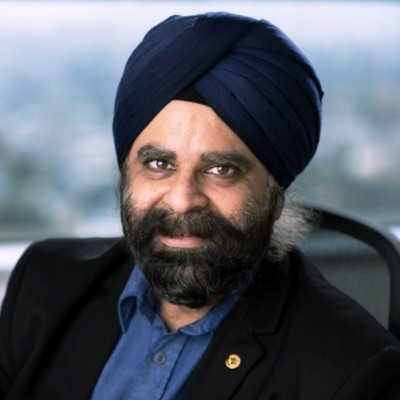
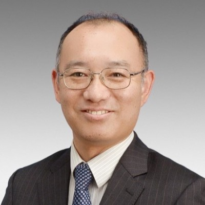
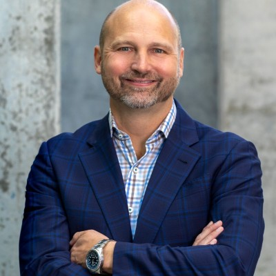

# Panel

**Title:** Interconnects at the Edge Data Center: What are the roles of Scale-Up, Scale-Out, and Scale-Across now?

**Abstract:** 

Inference is moving in a big way from the Core to the Edge, in the form of Edge data centers (and smaller things at the edge), whether operated by Neoclouds, specialized operators, industries, or enterprises. How do the interconnects within and between these Edge data centers differ from those of the Core? Where do the constraints of power and latency influence the architectures and technologies for Scale-Up, Scale-Out, and Scale-Across? When do they operate cooperatively versus standalone? When is the connection to the Core considered Scale-Across or just the WAN? In this panel we will examine this critical, emerging venue for interconnects and learn what it can tell us about these classifications and applicable technologies.

 

**Moderator:** 

<table style="width: 100%; border-collapse: collapse;">
    <tbody>
        <tr style="vertical-align: top; text-align: left;">
        <td style="width: 30%; padding: 10px; border: none; text-align: center; font-size: 1.3em;">
            
             
            <strong>Timothy Crawford</strong> 
            <small>Managing Director, KeyBanc Capital Markets</small>
        </td>
        <td style="width: 70%; padding: 10px; border: none; text-align: justify;  font-size: 1.2em;">
            Timothy Crawford is Managing Director and Co-Head of the Mosaic group at KeyBanc Capital Markets, where he leads product development, strategy, and industry outreach for emerging technology. Tim joined KeyBanc Capital Markets through its acquisition of Pacific Crest Securities. Prior to joining the firm in 2008, he held a variety of engineering and program management roles over nine years at IBM, and managed global teams in both IBM’s Software and Systems Groups. Tim received an M.B.A. with Distinction from Cornell University's S.C. Johnson Graduate School of Management, an M.B.A. from Queens University in Ontario, Canada, and a B.S. in Electrical Engineering with Honors from the University of Arizona.
        </td>
        </tr>
    </tbody>
</table>

**Panelists:**
<table style="width: 100%; border-collapse: collapse;">
  <tbody>
    <!-- Inder Monga (ESnet) -->
    <tr style="vertical-align: top;">
      <td style="width: 30%; padding: 10px; text-align: center; font-size: 1.3em;">
         
        <strong>Inder Monga </strong> 
        <small>Director of Berkeley Lab’s Scientific Networking Division and Executive Director of Energy Sciences Network (ESnet)</small>
      </td>
      <td style="width: 70%; padding: 10px; text-align: justify; font-size: 1.2em;">
        Inder Monga is the Director of Berkeley Lab’s Scientific Networking Division and Executive Director of Energy Sciences Network (ESnet), the Department of Energy’s sole high-performance networking user facility and its data circulatory system. ESnet connects and provides services to more than 50 DOE research sites, including national laboratories, supercomputing facilities, and scientific instruments, and peers with 270+ research and commercial networks worldwide. Inder is also the Deputy Project Lead for the American Science Cloud project for the Genesis Mission, principal investigator for the Quantum Application Network Testbed for Novel Entanglement Technology (QUANT-NET) project, and co-PI of the National Science Foundation’s FABRIC testbed. The holder of 25 patents, he received a B.S. in electrical/electronics engineering from the Indian Institute of Technology, a master’s in computer engineering from Boston University, and is completing his Ph.D. in computer science at the University of Amsterdam.
      </td>
    </tr>
    <!-- Yosuke Aragane (NTT) -->
    <tr style="vertical-align: top;">
      <td style="width: 25%; padding: 10px; text-align: center; font-size: 1.3em;">
         
        <strong> Yosuke Aragane</strong> 
        <small> Vice President, IOWN Development Office,   NTT </small>
      </td>
      <td style="width: 75%; padding: 10px; font-size: 1.2em;">
        In 1997, he joined the Multimedia Network Laboratories, NTT Corporation, Japan where he worked on human factor and communication control method in intelligent transportation systems. Since 2003 to 2008, he has been with the Information Sharing Platform Laboratories, NTT Corporation where he worked on cyber security related R&D especially in social engineering.  Since 2008 to 2011, he has been with Technology Sector, IT Innovation Department, NTT East Corporation where he developed R&D strategies and managed network/service infrastructure investigation as a senior manager.  Since 2011 to 2012, he has been with the Information Sharing Platform Laboratories, NTT Corporation, where he managed strategy development and established new Laboratories called NTT Secure Platform Laboratories.  In 2012, he was transfered into NTT Secure Platform Laboratories and managed whole activities of the laboratories as the chief secretary. In 2015, he was a senior director of NTT-CERT that is the representative CSIRT of NTT Group.  Since 2016, he has been the chief security producer in NTT R&D planning department of NTT headqualter's office, where he has been promoting security related technologies and business across NTT groups. Since 2019, he has the Vice President of IOWN Development Office, NTT headquarters, where he has been leading IOWN technology development. In 2020, he established the IOWN Global Forum with Intel and SONY, where over 100 global companies have been working together to develop IOWN relevant technologies and use cases. He is also the alternate director of the forum, leader of recruitment task force, and leader of PoC Consultation task force of the forum. He is a core founding member of the forum.
      </td>
    </tr>
    <!--  Tanner Ryan (Cloudflare) -->
    <tr style="vertical-align: top;">
      <td style="width: 25%; padding: 10px; text-align: center; font-size: 1.3em;">
         
        <strong>Tanner Ryan</strong> 
        <small>Network Engineer at Cloudflare</small>
      </td>
      <td style="width: 75%; padding: 10px; font-size: 1.2em;">
        Tanner is a Network Engineer at Cloudflare, where he helps grow one of the world’s largest global networks: 500 Tbps of edge capacity across 330+ cities in 120+ countries, interconnected with over 13,000 networks. His work spans peering and transit, data center and interconnection architecture, BGP and traffic optimization, and automation for efficient infrastructure scaling.
      </td>
    </tr>
    <!-- Marc Austin, CEO of Hedgehog. -->
    <tr style="vertical-align: top;">
      <td style="width: 25%; padding: 10px; text-align: center; font-size: 1.3em;">
         
        <strong>Marc Austin</strong> 
        <small>CEO and Founder - Hedgehog</small>
      </td>
      <td style="width: 75%; padding: 10px; font-size: 1.2em;">
        Marc Austin is the Chief Executive Officer and founder of Hedgehog. Marc is a fox who knows many things and a hedgehog who knows one big thing. As a Hedgehog he knows that millions of cloud operations teams will use Hedgehog AI networks to train and fine tune AI models for inference at the data edge. As a fox he knows many things from his experience leading mass-scale automation strategy at Cisco, Internet of Things networking at Jasper, digital media delivery at Amazon, mobile application development founding Canvas, the birth of smartphones at AT&T, early mobile ride sharing founding Mobiquity, internet search at Infoseek, e-commerce at Internet Shopping Network and leading people through adversity in the United States Army.
      </td>
    </tr>
    <!-- Ofer Shapiro, Investor. -->
    <tr style="vertical-align: top;">
      <td style="width: 25%; padding: 10px; text-align: center; font-size: 1.3em;">
         
        <strong>Ofer Shapiro</strong> 
        <small>Investor</small>
      </td>
      <td style="width: 75%; padding: 10px; font-size: 1.2em;">
        Ofer is a founder, inventor, investor, mentor and board member in startup companies. Since 2015, he has lead the funding of twelve  companies and worked with entrepreneurs in creating successful companies with breakthrough technologies that has the potential to change the world. As Vidyo co-founder and CEO for ten years and in RADVSION, he was an innovative force at the heart of major architectural transformations in the videoconferencing industry since 1996. He developed both the technologies and go-to-market approach that help shaped this industry. He loves building strategic partnerships and done this successfully with giants such as Google, HP, Nintendo, Philips, Ricoh, Hitachi and many others. He has also raised more than $150M for Vidyo. Technology innovations are often enabled by standards. He was involved in the development of the H.323 specification and the first IP based multi-point control unit architecture and gatekeepers, as well as the use of H.264 Scalable Video Coding (SVC) for video conferencing, and led the development of a new media relay based architecture- the VidyoRouter. He is named inventor 80 patents including patents relating to H.264, H265 V2 and VP8 payload format. Ofer was named a World Economic Forum Technology Pioneer, and received the Wall Street Journal Innovation award for economic disruption that transformed the industry, in the category of Internet, Networking and Broadband.
      </td>
    </tr>
  </tbody>
</table>