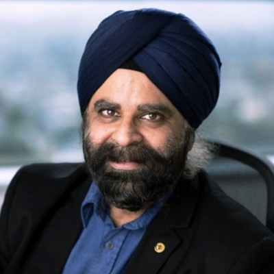
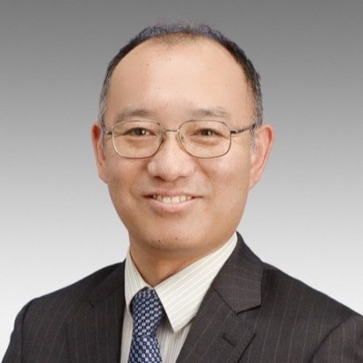
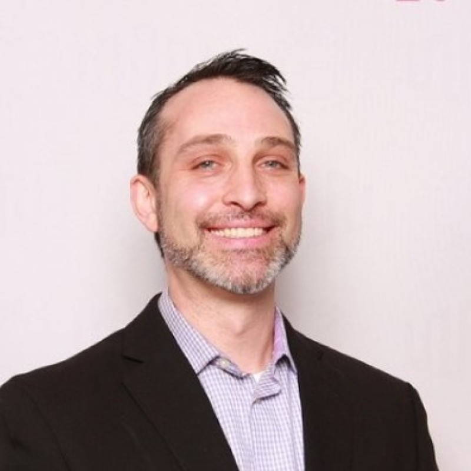
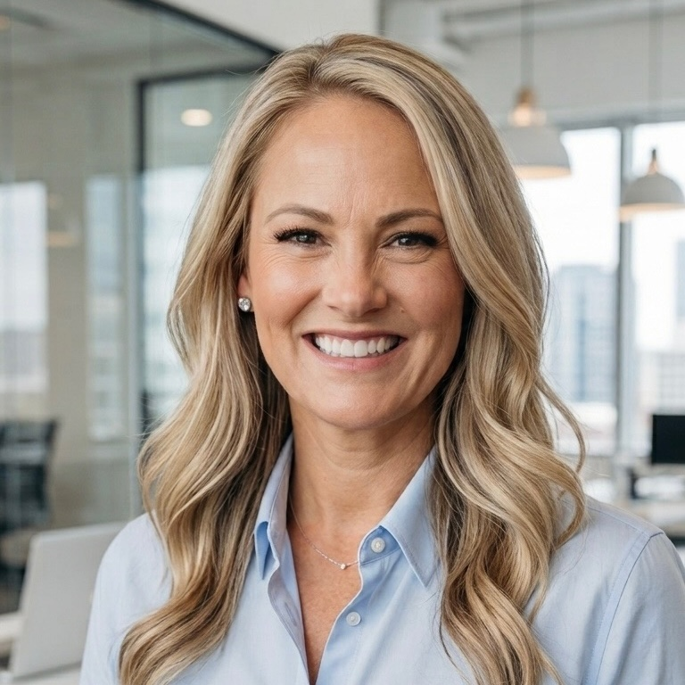

# Panel

**Title:** Interconnects at the Edge Data Center: What are the roles of Scale-Up, Scale-Out, and Scale-Across now?

**Abstract:** 

Inference is moving in a big way from the Core to the Edge, in the form of Edge data centers (and smaller things at the edge), whether operated by Neoclouds, specialized operators, industries, or enterprises. How do the interconnects within and between these Edge data centers differ from those of the Core? Where do the constraints of power and latency influence the architectures and technologies for Scale-Up, Scale-Out, and Scale-Across? When do they operate cooperatively versus standalone? When is the connection to the Core considered Scale-Across or just the WAN? In this panel we will examine this critical, emerging venue for interconnects and learn what it can tell us about these classifications and applicable technologies.

 

**Moderator:** 
<table style="width: 100%; border-collapse: collapse;">
    <tbody>
        <tr style="vertical-align: top; text-align: left;">
        <td style="position: relative; width: 30%; padding: 10px 10px 32px; border: none; text-align: center; font-size: 1.3em;">
            
             
            <strong>Timothy Crawford</strong> 
            <small>Managing Director, KeyBanc Capital Markets</small>
            

        </td>
        <td style="position: relative; width: 70%; padding: 10px 10px 32px; border: none; text-align: justify;  font-size: 1.2em;">
            Timothy Crawford is Managing Director and Co-Head of the Mosaic group at KeyBanc Capital Markets, where he leads product development, strategy, and industry outreach for emerging technology. Tim joined KeyBanc Capital Markets through its acquisition of Pacific Crest Securities. Prior to joining the firm in 2008, he held a variety of engineering and program management roles over nine years at IBM, and managed global teams in both IBM’s Software and Systems Groups. Tim received an M.B.A. with Distinction from Cornell University's S.C. Johnson Graduate School of Management, an M.B.A. from Queens University in Ontario, Canada, and a B.S. in Electrical Engineering with Honors from the University of Arizona.
            

        </td>
        </tr>
    </tbody>
</table>

**Panelists:**
<table style="width: 100%; border-collapse: collapse;">
  <tbody>
    <!-- Inder Monga (ESnet) -->
    <tr style="vertical-align: top;">
      <td style="width: 30%; padding: 10px; text-align: center; font-size: 1.3em;">
         
        <strong>Inder Monga </strong> 
        <small>Director of Berkeley Lab’s Scientific Networking Division and Executive Director of Energy Sciences Network (ESnet)</small>
      </td>
      <td style="width: 70%; padding: 10px; text-align: justify; font-size: 1.2em;">
        Inder Monga is the Director of Berkeley Lab’s Scientific Networking Division and Executive Director of Energy Sciences Network (ESnet), the Department of Energy’s sole high-performance networking user facility and its data circulatory system. ESnet connects and provides services to more than 50 DOE research sites, including national laboratories, supercomputing facilities, and scientific instruments, and peers with 270+ research and commercial networks worldwide. Inder is also the Deputy Project Lead for the American Science Cloud project for the Genesis Mission, principal investigator for the Quantum Application Network Testbed for Novel Entanglement Technology (QUANT-NET) project, and co-PI of the National Science Foundation’s FABRIC testbed. The holder of 25 patents, he received a B.S. in electrical/electronics engineering from the Indian Institute of Technology, a master’s in computer engineering from Boston University, and is completing his Ph.D. in computer science at the University of Amsterdam.
      </td>
    </tr>
    <!-- Yosuke Aragane (NTT) -->
    <tr style="vertical-align: top;">
      <td style="width: 25%; padding: 10px; text-align: center; font-size: 1.3em;">
         
        <strong>Yosuke Aragane</strong> 
        <small>Vice President, IOWN Development Office, NTT</small>
      </td>
      <td style="width: 75%; padding: 10px; font-size: 1.2em;">
        Yosuke Aragane heads the office that develops and promotes NTT's all-photonic network IOWN. In 1997, he joined the Multimedia Network Laboratories, NTT Corporation, Japan where he worked on human factor and communication control method in intelligent transportation systems. Since 2003 to 2008, he has been with the Information Sharing Platform Laboratories, NTT Corporation where he worked on cyber security related R&D especially in social engineering.  Since 2008 to 2011, he has been with Technology Sector, IT Innovation Department, NTT East Corporation where he developed R&D strategies and managed network/service infrastructure investigation as a senior manager.  Since 2011 to 2012, he has been with the Information Sharing Platform Laboratories, NTT Corporation, where he managed strategy development and established new Laboratories called NTT Secure Platform Laboratories.  In 2012, he was transfered into NTT Secure Platform Laboratories and managed whole activities of the laboratories as the chief secretary. In 2015, he was a senior director of NTT-CERT that is the representative CSIRT of NTT Group.  Since 2016, he has been the chief security producer in NTT R&D planning department of NTT headqualter's office, where he has been promoting security related technologies and business across NTT groups. Since 2019, he has the Vice President of IOWN Development Office, NTT headquarters, where he has been leading IOWN technology development. In 2020, he established the IOWN Global Forum with Intel and SONY, where over 100 global companies have been working together to develop IOWN relevant technologies and use cases. He is also the alternate director of the forum, leader of recruitment task force, and leader of PoC Consultation task force of the forum. He is a core founding member of the forum.
      </td>
    </tr>
    <!--  Tanner Ryan (Cloudflare) -->
    <tr style="vertical-align: top;">
      <td style="width: 25%; padding: 10px; text-align: center; font-size: 1.3em;">
         
        <strong>Tanner Ryan</strong> 
        <small>Network Engineer at Cloudflare</small>
      </td>
      <td style="width: 75%; padding: 10px; font-size: 1.2em;">
        Tanner is a Network Engineer at Cloudflare, where he helps grow one of the world’s largest global networks: 500 Tbps of edge capacity across 330+ cities in 120+ countries, interconnected with over 13,000 networks. His work spans peering and transit, data center and interconnection architecture, BGP and traffic optimization, and automation for efficient infrastructure scaling.
      </td>
    </tr>
    <!-- Gabriel Montanti, VP Sales of Hedgehog. -->
    <tr style="vertical-align: top;">
      <td style="width: 25%; padding: 10px; text-align: center; font-size: 1.3em;">
         
        <strong>Gabriel Montanti</strong> 
        <small>VP Sales, Hedgehog</small>
      </td>
      <td style="width: 75%; padding: 10px; font-size: 1.2em;">
        Gabe's passions are building cloud infrastructure and networking solutions that transform how enterprises connect, scale, and innovate. From the earliest stages of his career, he has been driven by the challenge of turning complex technical problems into simple, elegant platforms that unlock new possibilities for customers.
          
        Over the years, Gabe has led product organizations through growth, transformation, and market disruption, building businesses from the ground up, restructured portfolios to restore profitability, and introduced breakthrough products that redefined how enterprises approach multi-cloud connectivity. Along the way, he has guided teams spread across the globe, developed leaders who now shape the industry, and partnered with some of the world’s most influential enterprises to co-create solutions that moved entire markets forward.
          
        His leadership philosophy blends technical depth with business acumen. He thrives at the intersection of product, engineering, and customer needs—where bold vision meets disciplined execution. He has cultivated expertise across cloud-native networking, software-defined infrastructure, and AI-ready platforms, while also shaping the financial and strategic frameworks that sustain growth at scale.
      </td>
    </tr>
    <!-- Ofer Shapiro, Investor. -->
    <tr style="vertical-align: top;">
      <td style="width: 25%; padding: 10px; text-align: center; font-size: 1.3em;">
         
        <strong>Ofer Shapiro</strong> 
        <small>CEO and Co-Founder - Resolight</small>
      </td>
      <td style="width: 75%; padding: 10px; font-size: 1.2em;">
        Ofer Shapiro is CEO and Co-Founder of Resolight.ai, which believes the real breakthrough comes from coupling co-packaged optics (CPO) with the right network architecture. The data should be converted once at the transmitter and once at the receiver — and remain light throughout the network. This is the promise of Resolight’s native photonic processor: light-speed optical switching designed for AI scale-up networks. This architecture is built to reduce energy beyond what CPO can achieve on its own, unlock much larger scale-up radix, and enable AI clusters that are larger, faster, and more efficient.
          
        Ofer is a serial entrepreneur, investor, mentor and board member in multiple startup companies with breakthrough technology in photonics, AI, and the infrastructure needed to support these industries. He has created 12 ventures and delivered five disruptive architectures, which have been licensed by Google, Cisco, HP, Nintendo, Philips, Ricoh, Hitachi, and many others. The World Economic Forum named Ofer a Technology Pioneer and he received the Wall Street Journal Innovation award for economic disruption that transformed the industry in the category of Internet, Networking, and Broadband. He is a named inventor on 52 patents. Ofer is also CEO and co-founder of Quantum Pulse Ventures.
      </td>
    </tr>
    <!-- Amy Leeland (GEICO) -->
    <tr style="vertical-align: top;">
      <td style="width: 25%; padding: 10px; text-align: center; font-size: 1.3em;">
         
        <strong>Amy Leeland</strong> 
        <small>Sr. Dir., Compute &amp; Storage Cloud Engineering, GEICO</small>
      </td>
      <td style="width: 75%; padding: 10px; font-size: 1.2em;">
        Amy Leeland has been pushing the envelope in both cloud and edge computing for 20 years. In her 15 years at Intel she led initiatives in cloud and hyperscale software, open-source ecosystems, and edge computing. At Cloudflare she focused on network hardware, systems optimization, and performance engineering. Two years ago she was recruited to GEICO to head compute and storage-systems engineering where she is leading the revival of enterprise data centers. She thrives on finding creative solutions to complex system problems following the principles of teamwork, a growth mindset, and action.
      </td>
    </tr>
  </tbody>
</table>