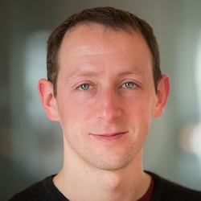

 

**Title:** LLM Token Economy: How is networking going to play in the age of agents?

**Abstract:** 

New business models in LLM workloads are reshaping the interconnect landscape. While ongoing challenges such as low latency, high bandwidth, and reliability persist, the emergence of scale-up networking creates new opportunities for performance with orders of magnitude more bandwidth. On the other end of the spectrum, applications are scaling across multiple data centers, trying to harness a million endpoints. The ability of software to deliver performance across the system holistically has become more challenging than ever, pushing the need for co-design. This HotI panel assembles experts from across the hardware and software stack to foster a discussion of these complex, multi-dimensional problems. The panel will explore the trade-offs between closed, and open AI models. Simultaneously, the panel will feature bleeding edge application developers, who will share their experiences leveraging current hardware, articulate their most pressing challenges, and envision the game-changing features that could revolutionize interconnect performance for their applications. 

 

**Moderator:** 

<table style="width: 100%; border-collapse: collapse;">
    <tbody>
        <tr style="vertical-align: top; text-align: left;">
        <td style="width: 30%; padding: 10px; border: none; text-align: center; font-size: 1.3em;">
            
             
            <strong>Peter Olcott</strong> 
            <small>Principal at First Spark Ventures</small>
        </td>
        <td style="width: 70%; padding: 10px; border: none; text-align: justify;  font-size: 1.2em;">
            Peter Olcott is a Principal at First Spark Ventures, where he focuses on early-stage investments in AI and networking technologies. With a background in both engineering and business, Peter brings a unique perspective to the intersection of hardware and software innovation.
        </td>
        </tr>
    </tbody>
</table>

**Panelists:**

<table style="width: 100%; border-collapse: collapse;">
  <tbody>
    <!-- Phill Brown -->
    <tr style="vertical-align: top;">
      <td style="width: 30%; padding: 10px; text-align: center; font-size: 1.3em;">
         
        <strong>Phill Brown</strong> 
        <small>AI Systems Engineer at Meta</small>
      </td>
      <td style="width: 70%; padding: 10px; text-align: justify; font-size: 1.2em;">
        Phil leads the design of AI Systems for Meta, integrating high performance accelerators, networking and facilities to create the industry-leading training & inference systems we use to deliver our AI services to our customers. Previously Phil worked at Graphcore (a UK-based startup building AI accelerators) and at Cray developing and delivering large scale high performance computing systems. Phil holds a PhD in computational chemistry from the University of Bristol.
      </td>
    </tr>
    <!-- Davor Capalija -->
    <tr style="vertical-align: top;">
      <td style="width: 25%; padding: 10px; text-align: center; font-size: 1.3em;">
         
        <strong>Davor Capalija</strong> 
        <small>Senior Fellow, AI Software and Architecture at Tenstorrent Inc.</small>
      </td>
      <td style="width: 75%; padding: 10px; font-size: 1.2em;">
        TBD
      </td>
    </tr>
    <!-- Ethan Lockshin -->
    <tr style="vertical-align: top;">
      <td style="width: 25%; padding: 10px; text-align: center; font-size: 1.3em;">
         
        <strong>Ethan Lockshin</strong> 
        <small>AE, Commercial at Groq</small>
      </td>
      <td style="width: 75%; padding: 10px; font-size: 1.2em;">
        TBD
      </td>
    </tr>
    <!-- Sid Sheth -->
    <tr style="vertical-align: top;">
      <td style="width: 25%; padding: 10px; text-align: center; font-size: 1.3em;">
         
        <strong>Sid Sheth</strong> 
        <small>Founder and CEO at d-Matrix</small>
      </td>
      <td style="width: 75%; padding: 10px; font-size: 1.2em;">
        TBD
      </td>
    </tr>
  </tbody>
</table>
