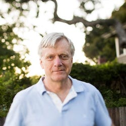





## Conference Day 1: Wednesday, August 18, 2021

<table>
<colgroup>
<col width="10%" />
<col width="45%" />
<col width="45%" />
</colgroup>
<thead>
<tr class="header">
<th>Time</th>
<th>Title</th>
<th>Presenters</th>
</tr>
</thead>
<tbody>

<tr>
<td markdown="span">08:45</td>
<td markdown="span">**Introduction and Welcome**</td>
<td markdown="span">General Chairs: Pavel Shamis and Manjunath Gorentla Venkata</td>
</tr>

<tr>
<td markdown="span">09:00</td>
<td markdown="span">**Keynote 1**: Compute Express Link (CXL) changing the game for Cloud Computing
 
<a href="assets/txt/dds_abstract.txt">[Abstract]</a>
</td>
<td markdown="span"> Debendra Das Sharma, Intel <a href="assets/txt/dds_bio.txt">[Bio]</a>
 

</td>
</tr>

<tr>
<td markdown="span">10:00</td>
<td markdown="span">**Diamond Sponsor Talk**</td>
<td markdown="span">Intel</td>
</tr>

<tr>
<td markdown="span">10:20</td>
<td markdown="span">*Break*</td>
<td markdown="span"></td>
</tr>

<tr>
<td markdown="span">10:35</td>
<td markdown="span">**Technical Paper Session A**: Specialized Network Hardware</td>
<td markdown="span"></td>
</tr>

<tr>
<td markdown="span"></td>
<td markdown="span">In-network reductions on a multi-dimensional HyperX</td>
<td markdown="span">Kartik Lakhotia (USC), Fabrizio Petrini (Intel), Rajgopal Kannan (US Army Research Lab), and Viktor Prasanna (USC)</td>
</tr>

<tr>
<td markdown="span"></td>
<td markdown="span">Hardware SYN Attack Protection For High Performance Load Balancers</td>
<td markdown="span">Reuven Cohen (Technion), Matty Kadosh (Nvidia), Alan Lo (Nvidia), and Qasem Sayah (Technion)</td>
</tr>

<tr>
<td markdown="span">11:35</td>
<td markdown="span">*Lunch*</td>
<td markdown="span"></td>
</tr>

<tr>
<td markdown="span">12:30</td>
<td markdown="span">**Technical Paper Session B**: Deep Learning</td>
<td markdown="span"></td>
</tr>

<tr>
<td markdown="span"></td>
<td markdown="span">Accelerating CPU-based Distributed DNN Training on Modern HPC Clusters using BlueField-2 DPUs</td>
<td markdown="span">Arpan Jain, Nawras Alnaasan, Aamir Shafi, Hari Subramoni, and Dhabaleswar K Panda (The Ohio State University)</td>
</tr>

<tr>
<td markdown="span"></td>
<td markdown="span">Efficient Multi-Path NVLink/PCIe-Aware UCX based Collective Communication for Deep Learning</td>
<td markdown="span">Yiltan Hassan Temucin, Amirhossein Sojoodi, Pedram Alizadeh and Ahmad Afsahi (Queen's University)</td>
</tr>

<tr>
<td markdown="span">13:30</td>
<td markdown="span">**Gold Sponsor Talks**</td>
<td markdown="span">Arista, IBM</td>
</tr>

<tr>
<td markdown="span">13:50</td>
<td markdown="span">*Break*</td>
<td markdown="span"></td>
</tr>

<tr>
<td markdown="span">14:05</td>
<td markdown="span">**Panel** -- Von Neumann vs. Programmable Logic Smart NICs: Which is the Dead End?
 
<a href="assets/txt/panel_abstract.txt">[Abstract]</a>
</td>
<td markdown="span">
**Moderator**: Scott Schweitzer (Achronix)  
**Team Von Neumann**: Mario Baldi (Pensando), Michael Kagan (NVIDIA), John Sakamoto (Marvell)  
**Team FPGA**: Chris Browning (Intel), Nick Ilyadis (Achronix), Ripduman Sohan (Xilinx)  
</td>
</tr>

<tr>
<td markdown="span">15:05</td>
<td markdown="span">**Head Bubba Memorial Cocktail Reception**</td>
<td markdown="span"></td>
</tr>

</tbody>
</table>

## Conference Day 2: Thursday, August 19, 2021

<table>
<colgroup>
<col width="10%" />
<col width="45%" />
<col width="45%" />
</colgroup>
<thead>
<tr class="header">
<th>Time</th>
<th>Title</th>
<th>Presenters</th>
</tr>
</thead>
<tbody>

<tr>
<td markdown="span">09:00</td>
<td markdown="span">**Keynote 2**: What is Next for Optics?
 
<a href="assets/txt/andy_abstract.txt">[Abstract]</a>
</td>
<td markdown="span"> Andy Bechtolsheim, Arista <a href="assets/txt/andy_bio.txt">[Bio]</a>
 

</td>
</tr>

<tr>
<td markdown="span">10:00</td>
<td markdown="span">**Platinum Sponsor Talks**</td>
<td markdown="span"></td>
</tr>

<tr>
<td markdown="span"></td>
<td markdown="span">
Meet Your Kinetic Data Centre - Composable Disaggregated Infrastructure
 
<a href="assets/txt/dell_abstract.txt">[Abstract]</a>
</td>
<td markdown="span">
Summit Puri (LIQID), David Nguyen (Dell)
 
<a href="assets/txt/dell_bios.txt">[Bios]</a>
</td>
</tr>

<tr>
<td markdown="span"></td>
<td markdown="span">GigaIO</td>
<td markdown="span">GigaIO</td>
</tr>

<tr>
<td markdown="span">10:30</td>
<td markdown="span">*Break*</td>
<td markdown="span"></td>
</tr>

<tr>
<td markdown="span">10:45</td>
<td markdown="span">**Technical Paper Session C**: Buses and Memory</td>
<td markdown="span"></td>
</tr>

<tr>
<td markdown="span"></td>
<td markdown="span">A low latency approach to delivering alternate protocols with coherency and memory semantics using PCI Express® 6.0 PHY at 64.0 GT/s</td>
<td markdown="span">Debendra Das Sharma (Intel)</td>
</tr>

<tr>
<td markdown="span"></td>
<td markdown="span">Programmable FPGA-based Memory Controller</td>
<td markdown="span">Sasindu Wijeratne, Sanket Pattnaik, Zhiyu Chen, Rajgopal Kannan and Viktor Prasanna (University of Southern California)</td>
</tr>

<tr>
<td markdown="span">11:45</td>
<td markdown="span">**Gold Sponsor Talks**</td>
<td markdown="span">Algo-logic, Tidalscale, Facebook</td>
</tr>

<tr>
<td markdown="span">12:15</td>
<td markdown="span">*Lunch*</td>
<td markdown="span"></td>
</tr>

<tr>
<td markdown="span">13:00</td>
<td markdown="span">**Technical Paper session D**: Routing and Switches</td>
<td markdown="span"></td>
</tr>

<tr>
<td markdown="span"></td>
<td markdown="span">Polarized routing: An efficient and versatile algorithm for large direct networks</td>
<td markdown="span">Cristóbal Camarero, Carmen Martinez and Ramon Beivide (University of Cantabria)</td>
</tr>

<tr>
<td markdown="span"></td>
<td markdown="span">MBitTree: A fast and scalable packet classification for software switches</td>
<td markdown="span">Jing Tan, Gaofeng Lv and Guanjie Qiao (NUDT)</td>
</tr>

<tr>
<td markdown="span">14:00</td>
<td markdown="span">**Silver Sponsor Talks**</td>
<td markdown="span">Ayar Labs, Lenovo</td>
</tr>

<tr>
<td markdown="span">14:10</td>
<td markdown="span">*Break*</td>
<td markdown="span"></td>
</tr>

<tr>
<td markdown="span">14:25</td>
<td markdown="span">**Technical Paper Session E**: Hot Topics</td>
<td markdown="span"></td>
</tr>

<tr>
<td markdown="span"></td>
<td markdown="span">The Future of Low Latency Memory</td>
<td markdown="span">Thomas Coughlin (Coughlin Associates, Inc.) and James Handy (Objective Analysis) </td>
</tr>

<tr>
<td markdown="span">14:45</td>
<td markdown="span">**Awards + Closing Remarks**</td>
<td markdown="span"></td>
</tr>

</tbody>
</table>

## Tutorials: Friday, August 20, 2021

<table>
<colgroup>
<col width="10%" />
<col width="45%" />
<col width="45%" />
</colgroup>
<thead>
<tr class="header">
<th>Time</th>
<th>Title</th>
<th>Presenters</th>
</tr>
</thead>
<tbody>

<tr>
<td markdown="span">09:00 - 12:00</td>
<td markdown="span">**Morning Sessions (in parallel)**</td>
<td markdown="span"></td>
</tr>

<tr>
<td markdown="span"></td>
<td markdown="span">High Performance Machine Learning, Deep Learning, and Data Science
 
<a href="assets/txt/dl_abstract.txt">[Abstract]</a>
</td>
<td markdown="span">Dhabaleswar K. (DK) Panda, Arpan Jain, and Aamir Shafi (The Ohio State University) 
 
<a href="assets/txt/dl_bios.txt">[Bios]</a>
</td>
</tr>

<tr>
<td markdown="span"></td>
<td markdown="span">Unified Communication X for Performance Portable Network Acceleration
 
<a href="assets/txt/ucx_abstract.txt">[Abstract]</a>
</td>
<td markdown="span">Oscar Hernandez (Nvidia), Jeffrey Young (Georgia Institute of Technology), Matthew Baker (Oak Ridge National Laboratory), Gilad Shainer (Nvidia), Yossi Itigin (Nvidia)
 
<a href="assets/txt/ucx_bios.txt">[Bios]</a>
</td>
</tr>

<tr>
<td markdown="span">12:00</td>
<td markdown="span">*Lunch*</td>
<td markdown="span"></td>
</tr>

<tr>
<td markdown="span">13:00 - 16:00</td>
<td markdown="span">**Afternoon Session**</td>
<td markdown="span"></td>
</tr>

<tr>
<td markdown="span"></td>
<td markdown="span">Introduction to Networking Technologies for High-Performance Computing
 
<a href="assets/txt/networking_abstract.txt">[Abstract]</a>
</td>
<td markdown="span">Dhabaleswar K. (DK) Panda and Hari Subramoni (The Ohio State University) 
 
<a href="assets/txt/networking_bios.txt">[Bios]</a>
</td>
</tr>

</tbody>
</table>
